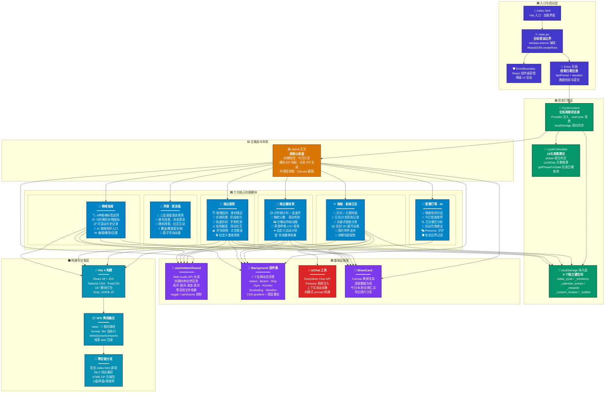

# 汐岛 — 技术架构介绍

## 架构总览



## 项目规模

| 维度 | 数据 | 备注 |
|------|------|------|
| 总源码行数 | ~8,400 行 | 纯手写，无冗余生成代码 |
| 页面组件 | 8 个 | Island / Ship / Gym / Kitchen / Beach / Snorkeling / Lighthouse / Entry |
| 共享组件 | 12 个 | 7 背景 + PhaseCard + ShareCard + ErrorBoundary + TipBubble + ActionButton |
| 自定义 Hooks | 2 个 | useAmbientSound (567行) · useCycleData |
| 工具模块 | 2 个 | aiChat (DeepSeek API 封装) · cycleCalculator (周期算法) |
| 数据文件 | 2 个 | 30条女性主义引言 · 12条社区漂流瓶预设 |
| 素材资源 | ~110 张 | PNG/AVIF/WebP/GIF 混合格式，按模块分目录管理 |
| 打包体积 | JS 110KB Gzip | 全量素材 37MB（含高清 AVIF 背景） |

## 技术栈

```
┌─────────────────────────────────────────────────────┐
│  React 18  ·  Vite 4  ·  Tailwind CSS  ·  PostCSS  │
│  Framer Motion  ·  Web Audio API  ·  Canvas API     │
│  localStorage  ·  DeepSeek Chat API                 │
│  IIFE Build  ·  file:// Protocol                   │
└─────────────────────────────────────────────────────┘
```

## 核心架构设计

### 1. 单向数据流 — 周期状态驱动全局

```
用户注册经期日期
        │
        ▼
  CycleContext (Provider)
   ├── register(lastPeriod, duration) → localStorage.setItem
   ├── useMemo → 实时推导 phase / cycleDay / phaseLabel
   └── useCycle() → 所有模块消费同一状态源
        │
        ├── 🎨 UI 层：背景色、图标、推荐文本自动切换
        ├── 🎵 音频层：useAmbientSound(phase) 自动切换环境音
        ├── 📊 数据层：各模块按 phase 过滤展示对应内容
        └── 🤖 AI 层：上下文注入当前周期数据
```

**设计优势**：新增模块只需 `const { cycleData } = useCycle()` 一行代码即可接入整个周期系统，无需重复计算、无需传参。

### 2. localStorage 持久化 — 离线优先

全部用户数据零后端依赖，9 个独立键空间各司其职：

```
xidao_cycle                  ← 周期基础（lastPeriod, duration）
xidao_calendar_entries       ← 海船日历（日志/计划，按日期索引）
xidao_emotions               ← 情绪海滩（标签 + 备注 + 时间戳数组）
xidao_gym_rewards            ← 运动成就（完成记录 + 日期）
xidao_kitchen_rewards        ← 料理成就（完成记录 + 日期）
xidao_kitchen_custom_recipes ← 自定义食谱（按时期分组）
xidao_gym_custom_exercises   ← 自定义运动（按时期分组）
xidao_bottles                ← 漂流瓶（用户投瓶记录）
xidao_community_*            ← 社区互动（撒盐/星星/回复）
```

### 3. Web Audio API 程序化环境音

567 行纯手写音频引擎，构建四种独立的声音合成器：

```
┌──────────┬──────────┬──────────────────────────────────────┐
│   时期   │   音景   │              合成链路                 │
├──────────┼──────────┼──────────────────────────────────────┤
│  经期    │   雨声   │ 白噪声→带通(800Hz)+pink drizzle     │
│          │          │ + 水滴正弦铃铛(800-2000Hz, 0.4s衰减) │
├──────────┼──────────┼──────────────────────────────────────┤
│  卵泡期  │ 晨风+风铃│ 布朗噪声→低通(400Hz)+LFO(0.06Hz)   │
│          │          │ + 随机风铃泛音(C5-E6, 3.5s衰减)     │
├──────────┼──────────┼──────────────────────────────────────┤
│  排卵期  │   海浪   │ 粉红噪声→低通(900Hz)+潮汐LFO(0.07Hz)│
│          │          │ + 泡沫层高通(2500Hz)+ 深层布朗噪声   │
├──────────┼──────────┼──────────────────────────────────────┤
│  黄体期  │ 秋日柔风 │ 布朗噪声→低通(350Hz)+ 双层LFO调制   │
│          │          │ + 树叶沙沙(1500Hz)+ 低频暖意(100Hz)  │
└──────────┴──────────┴──────────────────────────────────────┘
```

**核心特点**：零音频文件 → 零额外下载 → 纯数学合成 → 无限循环无接缝。

### 4. IIFE 离线构建 — 双击即用

Vite 配置将 React SPA 编译为单文件自执行脚本：

```
Vite Build 管线
  ├── @vitejs/plugin-react → JSX → JS
  ├── PostCSS + Tailwind → 原子 CSS
  ├── transformIndexHtml 插件 → 清理 dev 脚本
  ├── rollupOptions:
  │     format: 'iife'              ← 自执行函数，无需模块加载器
  │     inlineDynamicImports: true  ← 动态导入全内联
  └── base: './'                    ← 资源路径全部相对
            ↓
     dist/index.html + dist/assets/*.js
            ↓
     双击 → browser file:// 直接运行 ✅
```

## 技术亮点

### 🎨 生理周期驱动的全栈自适应 UI

四个时期不是简单的颜色替换，而是**四套独立完整的设计语言**：

| 时期 | 色调 | 环境音 | 隐喻 | 运动 | 食谱 |
|------|------|--------|------|------|------|
| 经期 | 灰蓝 `#64748B` | 雨声 | 船入港湾 | 瑜伽冥想 | 热可可+烤红薯 |
| 卵泡期 | 琥珀橙 `#FCD34D` | 晨风+风铃 | 扬帆起航 | 有氧跑步 | 青柠莫吉托 |
| 排卵期 | 亮黄青 `#FDE047` | 海浪 | 破浪前行 | 力量训练 | 海鲜大餐 |
| 黄体期 | 橙紫 `#FB923C` | 秋日柔风 | 迷雾巡航 | 舒缓增肌 | 蜂蜜吐司+姜汁 |

### 🍳 厨房：五种原生交互模拟真实烹饪

不依赖第三方手势库，全部基于浏览器原生 Touch/Mouse 事件：

| 交互模式 | 事件监听 | 视觉反馈 |
|----------|----------|----------|
| **拖拽投料** | mousedown/move/up | 食材跟随光标 + 落区高亮 + 弹簧回弹 |
| **长按研磨** | mousedown → setInterval(50ms) | 进度环 SVG stroke-dashoffset + 食材阶段 CSS filter |
| **快速切剁** | mousemove velocity > 阈值 | 切片轨迹粒子 + 食材裂开动画 |
| **滑动翻面** | mousemove 横向位移 | flipCount 计数 + CSS rotateY 翻转 |
| **点击推进** | onClick | 进度条填充 + 成品图渐变 + 步骤切换 |

### 💪 健身房：五种运动模式引擎

```
计时倒计时    → setInterval(1s) + SVG 圆环进度 + 随机鼓励话语
触控计数      → touch 上下滑动检测 + rep 计数 + 进度百分比
帧动画循环    → setInterval(400ms) + frameIndex 循环切换
冥想呼吸      → requestAnimationFrame + LFO 驱动的吸气/呼气相位 + 缩放动画
自定义运动    → 用户表单输入 → localStorage 存储 → 与内置运动同流程
```

### ✉️ 海船：3D 信封展开动画

纯 CSS transform 实现信封拆封效果：

```
信封外层: perspective + maxHeight: 90vh + flex column 布局
封盖层:   position: absolute + clipPath: polygon(▲) + rotateX(0→180deg)
          transition: transform 0.5s cubic-bezier
信纸层:   translateY(40px→0) + opacity(0→1)
          延迟 0.2s 触发，形成"信封先开，信纸后滑出"的层次感
内容区:   flex: 1 + overflow-y: auto
          长信纸内容可平滑滚动，横线纹理自适应内容长度
```

### 🌊 浮潜：三层深度递进的漂流瓶社区

```
浅海 (depth 0)   → 用户自己的投瓶记录，可编辑/删除
中层 (depth 1)   → 社区预设瓶子 + 随机混入用户瓶子
深海 (depth 2)   → 纯社区匿名瓶 + "撒盐"(SALTS)排队机制

每层不同的背景图(海底世界浅→深) + 瓶子浮动 CSS animation
投瓶 → 写入 localStorage → 下次捞瓶时混入社区池
```

### 🗼 灯塔：四模式 AI 对话系统

```
Persona 系统      "灯塔守护者汐汐" — 温柔坚定的女性陪伴者
                  → 海洋隐喻翻译身体经验
                  → 绝不说"你应该"，只说"可以试试"
                  → 不用委婉语(直接说"经期"不叫"大姨妈")

四模式 Prompt      情绪陪伴 → 开放式对话 + 情感共鸣
                  今日推荐 → 基于 phase 的活动/饮食建议
                  日志分析 → 情绪词频统计 + 时间模式识别
                  运动饮食 → 分时期的具体运动计划/食谱推荐

上下文注入         周期数据(phase, cycleDay)
                  + 最近10条情绪记录
                  + 当天/本周日历日志
                  + 运动成就历史

安全边界           自伤/自杀 → 温柔引导 + 专业资源引用
                  医疗症状 → 拒绝诊断 + 建议就医
                  不确定   → 诚实说"不知道"而非编造
```

### 📱 零依赖分发

- 无需 `npm install`、无需服务器、无需数据库
- 37MB ZIP 解压即用，双击 `dist/index.html`
- 所有数据存储在用户自己的浏览器 localStorage
- 隐私优先：数据不离开用户设备（AI 对话除外，可离线跳过）

---

> *"身体不是机器，周期不是故障。月经是力量，不是羞耻。"*
>
> — 汐岛·灯塔守护者汐汐
